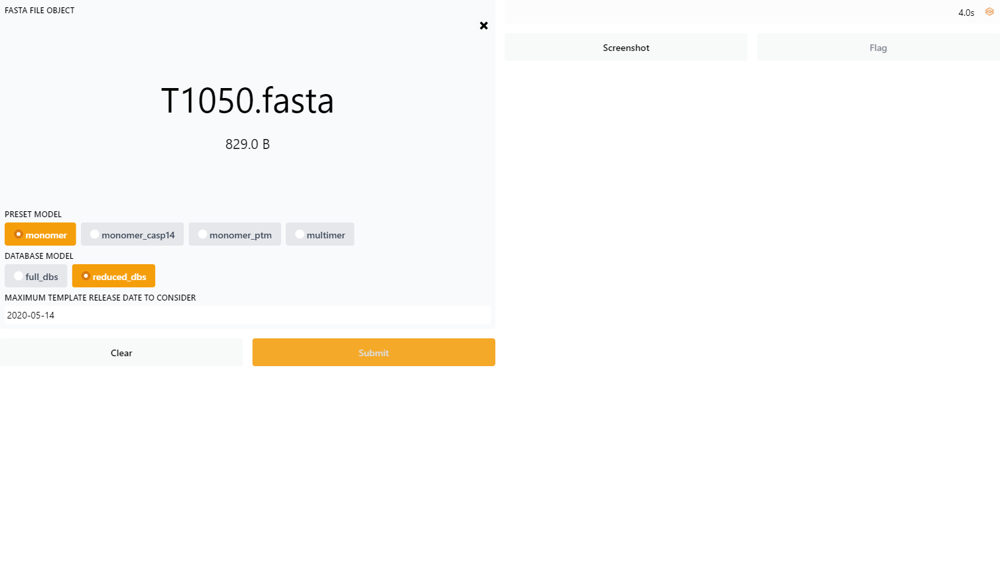
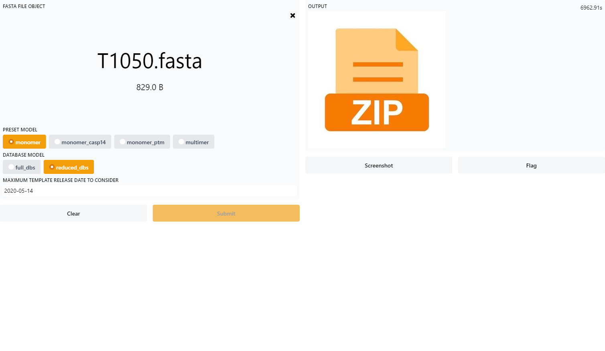

# AlphaFold + Gradio (in k8s)

This repository is a fork of [Deepmind's AlphaFold](https://github.com/deepmind/alphafold), it was
modified to enable integration with [Gradio](https://gradio.app/) and support for deploying [AlphaFold](https://doi.org/10.1038/s41586-021-03819-2) in 
Kubernetes.

The objective was to offer an interactive experience for scientists to [Protein folding prediction](https://deepmind.com/blog/article/alphafold-a-solution-to-a-50-year-old-grand-challenge-in-biology)
while leveraging elastic and scalable cloud platforms like Kubernetes. 

**Note: This work was an early attempt published out of passion. Happy to welcome any collaborators or contributors.**

## Instructions for setup

Follow the below instructions for setting up the environment.

### Prerequisites
A Workstation or PC with the following list of software is required to proceed further:
- [Docker](https://www.docker.com/)
- [Helm 3](https://helm.sh/)
- [AWS CLI](https://aws.amazon.com/cli/)
- [Kubectl](https://docs.aws.amazon.com/eks/latest/userguide/install-kubectl.html)

**This package was tested against AWS EKS Cluster v1.21.X**

Create following list of AWS resources:
- [AWS EKS Cluster with GPU support](https://aws.amazon.com/blogs/compute/running-gpu-accelerated-kubernetes-workloads-on-p3-and-p2-ec2-instances-with-amazon-eks/)
- (Optional) [AWS ECR](https://docs.aws.amazon.com/AmazonECR/latest/userguide/repository-create.html)

### First time setup
The following steps are required in order to run AlphaFold + Gradio (in AWS EKS):
1. [Configure kubectl](https://aws.amazon.com/premiumsupport/knowledge-center/eks-cluster-connection/) to previously provisioned AWS EKS cluster
2. Run below helm command to install the chart  
    <pre>
    helm repo add alphafold-gradio https://navashiva.github.io/alphafold
    helm install alphafold alphafold-gradio</pre>
    
3. Wait at least an hour for the [Genetic database](https://github.com/navashiva/alphafold#genetic-databases) to download before connecting to the Kubernetes service endpoint
    <pre>
    #Run below command to get service endpoint details
    #Pick the one with alphafold-gradio name
    kubectl get svc 
    </pre>
4. Here is the screenshot of the Gradio interface with Alphafold
    
5. It took at least a couple of hours for Alphafold to predict the Protein folding with single GPU upon submission. The response is a ZIP file to download.
    

## License and Disclaimer

This modified package adores all license terms and disclaimers mentioned in the [source repository](https://github.com/deepmind/alphafold#license-and-disclaimer)